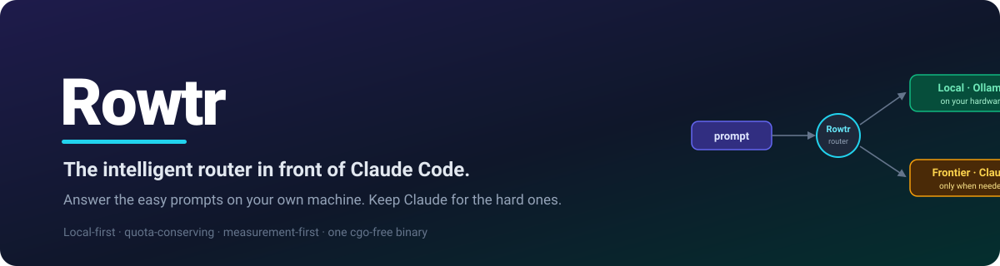
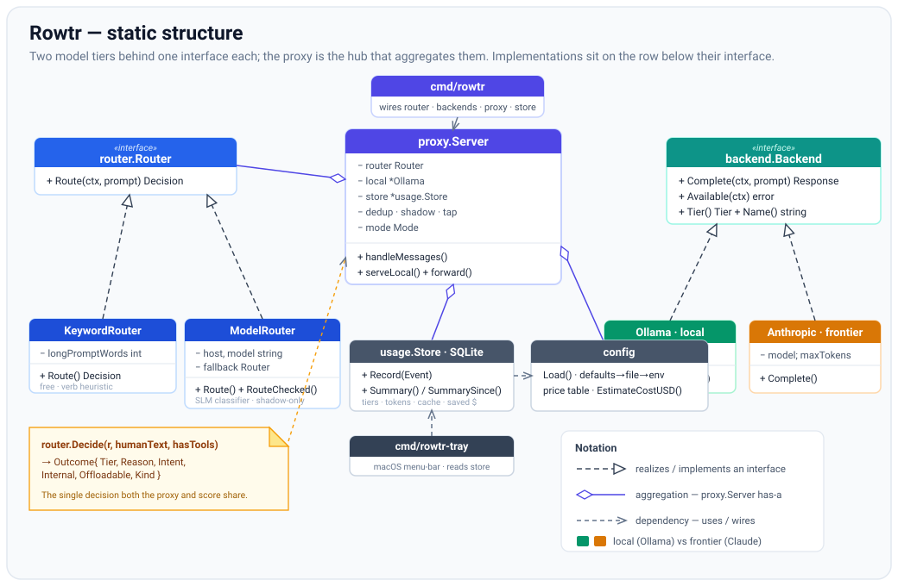
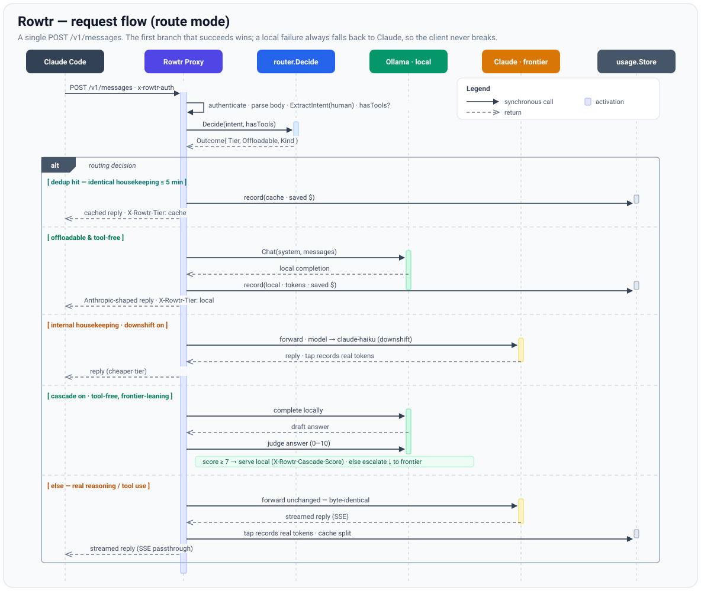

<div align="center">



<br/>

**Answer the easy prompts on your own machine. Keep Claude for the hard ones.**

[](https://github.com/9to5-worklife/rowtr/actions/workflows/smoke.yml)
[](go.mod)
[](LICENSE)


[Why Rowtr](#-why-rowtr) · [How it works](#-how-it-works) · [Quickstart](#-quickstart) · [Security](#-security-model) · [Contributing](CONTRIBUTING.md) · [Community](#-community)

</div>

---

Rowtr is a small, local proxy that sits transparently in front of **Claude Code**. It
inspects every request, and when a prompt is genuinely simple — summarize, define,
classify, generate a commit message — it answers it with a cheap model running **on
your own machine** via [Ollama](https://ollama.com). Everything that needs real
reasoning, or uses tools, still goes to Claude, untouched.

The result: you stretch your Claude quota further without giving up frontier quality,
and Rowtr keeps the receipts — every request logs its tier, tokens, and estimated
savings.

- 🛡️ **Local (Gatekeeper)** — cheap/fast, on your hardware via Ollama. Handles the
  high-volume, low-complexity majority.
- 🧠 **Frontier (Expert)** — powerful/expensive, via Anthropic's Claude. Reserved for
  reasoning, synthesis, and anything with tool use.
- 🔀 **The Router** — inspects each prompt and picks a tier. Today it's a free keyword
  heuristic; it only gets smarter once a scoreboard *proves* the added cost pays off.

---

## ✨ Why Rowtr

Most LLM routers optimize **dollar cost** and route *between cloud providers* — your
prompts still leave your machine, and still spend metered budget. Rowtr makes a
different bet, built for the person paying a **flat Claude subscription**, where the
thing that actually hurts is *running out of quota*.

| | Optimizes for | Where prompts run | Best-fit user |
|---|---|---|---|
| OpenRouter / LiteLLM / Portkey | $ cost, model breadth, governance | Cloud providers | Teams billing per-token across many models |
| RouteLLM / Not Diamond / Martian | Best model per query | Cloud providers | Builders embedding a routing brain |
| Point Claude Code at Ollama | Free / offline | Fully local (replaces Claude) | Users OK with local-only quality |
| **Rowtr** | **Claude quota kept + on-device privacy** | **Local for easy turns, Claude for hard ones** | **Flat-subscription Claude Code users** |

**What sets Rowtr apart:**

- **Quota conservation, not cost arbitrage.** The headline number is *tokens and
  requests kept off your Claude quota* — what a flat-rate subscriber actually feels.
- **Local-first & private for what it offloads.** Prompts Rowtr answers locally never
  leave your machine. *(Scope: only the offloaded subset is local — anything that needs
  Claude still goes to Anthropic, exactly as before.)*
- **Additive, not a replacement.** Pointing Claude Code straight at Ollama trades away
  frontier quality on hard tasks. Rowtr keeps Claude for real work and sheds only the
  easy stuff, *per request*.
- **Measurement-first & safe by default.** Every request logs tier/tokens/category. The
  default is **observe mode** — log-only, nothing rerouted — until you explicitly
  consent. Ambiguous or tool-bearing requests always go to Claude.
- **Zero infrastructure.** One cgo-free binary writing to a local SQLite file. No
  Postgres, no Redis, no account, no fee, no third party seeing your traffic.

---

## 🧭 How it works

Two model tiers behind one interface, a proxy that decides per request, and a usage
store that records every decision so you can measure it.

<p align="center">
  
</p>

In **route mode**, a single `POST /v1/messages` flows through the proxy like this — the
first branch that succeeds wins, and any local failure falls back to Claude cleanly, so
the client never breaks:

<p align="center">
  
</p>

> **Intent-aware routing.** Rowtr routes on the *human's* prompt, not the raw last
> message. It strips Claude Code's injected wrappers (`<system-reminder>`, transcripts,
> slash-command tags) and flags agent-internal machinery (fetched web pages, "perform a
> web search…", suggestion mode) so those are never offloaded — even when they contain
> routing keywords.

---

## 🚀 Quickstart

### 1. Prerequisites

- **Go 1.26+** — `go version`
- **[Ollama](https://ollama.com)** for the local tier (`rowtr setup` can install it for you)
- **Claude access** — either a Claude Code login (Rowtr forwards it, no key needed) or
  `export ANTHROPIC_API_KEY=sk-ant-...`

### 2. Build

```bash
git clone https://github.com/9to5-worklife/rowtr && cd rowtr
go build -o rowtr ./cmd/rowtr      # produces ./rowtr — rebuild after code changes
```

> Release binaries and a one-line installer (`scripts/install.sh`) exist but are
> hand-distributed for now — see [Trust & distribution](#-trust--distribution).
> Building from source is one command and removes all doubt.

### 3. Set up (recommended)

```bash
./rowtr setup            # add --install to install Ollama, --pull to fetch the model, --probe to test your key
```

`setup` checks your hardware, **recommends a local model sized to your RAM**, verifies
Ollama and Claude access, and writes a config file so you don't need env vars
(`~/Library/Application Support/rowtr/config.json` on macOS, `~/.config/rowtr/` on
Linux). Hands-off bootstrap on a bare machine: `./rowtr setup --yes --install --pull`.

### 4. Run

```bash
./rowtr claude                   # starts the proxy if needed, launches Claude Code wired to it
./rowtr claude --resume          # extra args pass straight through to claude
```

That's it — use Claude Code exactly as before. On first run Rowtr asks once whether to
route eligible prompts locally (until you consent, it stays in safe **observe** mode).

---

## 🛠️ Ways to run it

<details>
<summary><b>CLI — one prompt at a time</b></summary>

```bash
./rowtr "define entropy"                 # → routed local
./rowtr "compare REST and gRPC"          # → routed frontier
./rowtr --tier local "list 3 colors"     # force a tier
./rowtr --json "summarize DNS"           # machine-readable output
echo "translate hello to French" | ./rowtr
```

The answer prints to **stdout**; the routing line (tier · reason · model · latency ·
tokens · cost) prints to **stderr**.
</details>

<details>
<summary><b>Proxy — manual control</b></summary>

```bash
./rowtr serve                    # observe mode (default): forward all, log routing
./rowtr serve --mode route       # route mode: divert Local + tool-free requests to Ollama
# then, in another terminal:
ANTHROPIC_BASE_URL=http://127.0.0.1:8787 claude
```

- **observe** — 100% safe. Everything still goes to Claude; Rowtr just logs the tier
  each prompt *would* take. Use it to measure real traffic first.
- **route** — actually offloads Local + tool-free requests; everything else (including
  every tool-using turn) still goes to Claude. Locally-served turns carry an
  `X-Rowtr-Tier: local` response header.
</details>

<details>
<summary><b>Scoreboard — measure the routing</b></summary>

```bash
./rowtr score                          # regression set (evals/router.jsonl)
./rowtr score --router both            # compare the keyword vs model router, list disagreements
./rowtr score --set generalization     # score the held-out set (see below)
```

Prints accuracy plus a confusion breakdown — **FP** = wrongly sent local (a quality
risk), **FN** = a missed saving — and lists every mismatch with its reason.

**Grow a *held-out* set from real traffic.** The regression set is circular — it can't
tell you the router generalizes. Run a session with shadow mode on
(`rowtr serve --shadow`), then:

```bash
./rowtr label                          # walk the router disagreements, label each → evals/generalization.jsonl
./rowtr score --set generalization --router both
```

`label` only asks about cases the keyword and model routers disagreed on — exactly the
cases the regression set doesn't cover. Treat the generalization accuracy as the number
to beat before making the router fancier.
</details>

<details>
<summary><b>Usage — see what you kept off quota</b></summary>

```bash
./rowtr usage                    # cross-platform stats: offload rate, tokens kept off quota, by-model
```

On macOS, `rowtr-tray` shows the same numbers in the menu bar
(`go build -o rowtr-tray ./cmd/rowtr-tray`, needs cgo).
</details>

---

## ⚙️ Configuration

Config lives in the config file (written by `setup`); every value has an env override.

| Var | Default | Meaning |
| --- | --- | --- |
| `ROWTR_LOCAL_MODEL` | `gemma3n:e2b` | Ollama model for the local tier |
| `ROWTR_FRONTIER_MODEL` | `claude-opus-4-8` | Claude model for the frontier tier |
| `OLLAMA_HOST` | `http://localhost:11434` | Ollama daemon URL |
| `ANTHROPIC_API_KEY` | — | Anthropic key (read by the SDK; optional if using Claude Code login) |
| `ROWTR_PROXY_ADDR` | `127.0.0.1:8787` | Proxy listen address (loopback only) |
| `ROWTR_PROXY_MODE` | `observe` | `observe` or `route` |
| `ROWTR_DOWNSHIFT_MODEL` | `claude-haiku-4-5` | Cheaper Claude tier for housekeeping (`off` to disable) |
| `ROWTR_CASCADE` | `0` | Try-local-then-judge before frontier (experimental) |
| `ROWTR_CASCADE_JUDGE` | `local` | Who grades the cascade answer: `local` (self-judge) or `haiku` (cheap Claude) |
| `ROWTR_ROUTER_MODEL` | `gemma3:270m` | SLM classifier for the shadow/model router |
| `ROWTR_ROUTER_OLLAMA_HOST` | — | Host for the router model (e.g. a Raspberry Pi) |
| `ROWTR_SHADOW` | `0` | Run the model router in shadow mode alongside keyword |

> Confirm your exact local model tag with `ollama list` and override `ROWTR_LOCAL_MODEL`
> if it differs.

---

## 🎛️ Features

- **Local offload** of eligible, tool-free prompts, translated into Anthropic's
  streaming + non-streaming response shape so the client can't tell.
- **Downshift** — internal housekeeping that can't go fully local is rewritten onto a
  cheaper Claude tier (Haiku) instead of Opus.
- **Dedup replay** — identical housekeeping requests within a short window replay from an
  in-memory cache.
- **Cascade** *(opt-in)* — a FrugalGPT-style try-local-then-judge that escalates to
  Claude only when the local answer scores too low. Off by default until its quality is
  measured.
- **Prompt-cache-aware accounting** — parses real cache read/write tokens so the
  scoreboard reflects what Anthropic actually billed.
- **Shadow mode** *(experimental)* — runs a tiny SLM classifier alongside the keyword
  router without ever taking control, mining disagreements as labeling data.

---

## 🔒 Security model

Rowtr is designed to sit in your credential path without becoming a liability. Highlights:

- **Loopback only.** `serve` refuses non-local bind addresses and cleartext remote
  upstreams.
- **Mutual auth.** A 32-byte token (created `0600` in your config dir) plus an
  HMAC-SHA256 health proof means `rowtr claude` will only trust a proxy that holds the
  token file, and the proxy rejects `/v1/messages` calls that don't present it.
- **Log hygiene.** Prompt text never lands in `proxy.log` (routing signals only, unless
  you opt into `ROWTR_DEBUG_INTENT`); the log is `0600` and truncates past 5 MB.
- **Explicit consent.** Local routing is opt-in and persisted — silence is never
  treated as consent.

Full details and how to report a vulnerability: **[SECURITY.md](SECURITY.md)**.

---

## 📊 What's exact vs estimated

Honesty matters for a tool whose whole point is measurement:

- **Exact:** token counts for local offloads and real frontier requests (parsed from
  Anthropic's `usage`, including cache read/write splits).
- **Estimated:** **saved $** = Claude's price × the tokens you kept off quota. It's a
  counterfactual, not a bill. On a flat subscription the honest headline is *quota kept*
  (tokens/requests), with dollars a secondary, hedged line.

---

## 🗂️ Project layout

```
cmd/rowtr        CLI: one-shot + setup + serve (proxy) + score + usage + claude
cmd/rowtr-tray   macOS menu-bar app showing usage kept off quota (cgo)
internal/router  Router interface, keyword + model routers; Decide()/ExtractIntent()
internal/backend Backend interface + Ollama (local) and Anthropic (frontier)
internal/proxy   Anthropic-compatible reverse proxy: offload, downshift, dedup, cascade, shadow
internal/usage   SQLite usage store (pure-Go modernc.org/sqlite)
internal/eval    scoreboard: score the offload decision against a labeled set
internal/setup   first-run system check, model recommendation, config file
internal/sysinfo host detection (RAM/arch) for the model recommendation
internal/config  defaults → config file → env; price table
docs/            architecture + request-flow diagrams
evals/           labeled eval cases (router.jsonl)
```

---

## 🧑‍💻 Develop

```bash
go build ./...
go vet ./...
go test ./...   # router decisions are covered by table-driven tests
```

Contributions welcome — please read **[CONTRIBUTING.md](CONTRIBUTING.md)** first.

---

## 🤝 Trust & distribution

Release binaries are currently unsigned and hand-distributed. **If you didn't get a zip
directly from someone you trust, build from source** (`go build ./cmd/rowtr`) — one
command, no question. Signed, notarized, CI-built releases come when distribution widens.
CI (GitHub Actions) builds and smoke-tests on macOS, Linux, and Windows on every push.

---

## 💬 Community

- 🐦 **X / Twitter:** [@ChuckGUYH](https://x.com/ChuckGUYH)
- 🐛 **Issues & ideas:** [GitHub Issues](https://github.com/9to5-worklife/rowtr/issues)
- 🔒 **Security reports:** see [SECURITY.md](SECURITY.md)

---

## 📄 License

[PolyForm Noncommercial 1.0.0](LICENSE) — free to use, modify, and share for any
**noncommercial** purpose. Commercial use requires permission.
